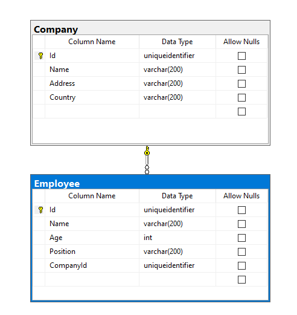

 

 


<!-- PROJECT LOGO -->
<br />
<div align="center">
  <a href="https://github.com/HelibertoArias/RoccoGraphQL">
    
  </a>

  <h3 align="center">Muvids Web API</h3>
 


</div>
<!-- TABLE OF CONTENTS -->
<details>
  <summary>Table of Contents</summary>
  <ol>
    <li>
      <a href="#about-the-project">About The Project</a>
      <ul>
        <li><a href="#built-with">Built With</a></li>
      </ul>
    </li>
    <li>
      <a href="#getting-started">Getting Started</a>
      <ul>
        <li><a href="#prerequisites">Prerequisites</a></li>
        <li><a href="#installation">Installation</a></li>
      </ul>
    </li>
    <li><a href="#usage">Usage</a></li>
    <li><a href="#contact">Contact</a></li>
   
  </ol>
</details>


<!-- ABOUT THE PROJECT -->
## About The Project

This project is a GraphQL API for handling basic information in Rocco Company.

Here we will find Companies and Employees.

   


<p align="right">(<a href="#top">back to top</a>)</p>


### Built With

This GraphQL API has build using ASP.NET Core Web API using .NET 6.0. 
Some of the Nuget Packages used here are:

- [GraphQL for .NET](https://www.nuget.org/packages/GraphQL/)
- [Entity Framework Core for SQL Server](https://www.nuget.org/packages/Microsoft.EntityFrameworkCore.SqlServer)
- [GraphQL Playground integration for ASP.NET Core](https://www.nuget.org/packages/GraphQL.Server.Ui.Playground)
 
<p align="right">(<a href="#top">back to top</a>)</p>


<!-- GETTING STARTED -->
## Getting Started

Here some steps to run the application.


### Prerequisites

- Visual Studio 2022 or Visual Studio Code
- SDK .NET 6
- SQL Server Express 2019 or other version will works.

### Installation

_To start using the application you should._

1. Clone the repo.
   ```sh
   git clone https://github.com/helibertoarias/RoccoGraphQL.git
   ```
2. Open the solution RoccoGraphQL.sln and build to restore the Nuget Packages.
3. Open the file ./RoccoGraphQL/appsettings.development.json and update the user and password. Here there is an example using a SQL Express connection.
    ```json
    "ConnectionStrings": {
      "RoccoConnectionString": "localhost\\SQLEXPRESS; database=Rocco; Integrated Security=true",
    ```
4. In Visual Studio 2022 open a new terminal Package Manager Console. Then, run the following command to create the database.
    ```cmd
    Update-Database
     ```
5. After this you can run the application. The Playground UI will show up in the following URL
 [https://localhost:7070/ui/playground](https://localhost:7070/ui/playground)


<p align="right">(<a href="#top">back to top</a>)</p>


<!-- USAGE EXAMPLES -->
## Usage

To validate the GraphQL API you can try this in the Playground UI.

1. Simple query: Run a query to get information for all companies.
```json
{
  companies {
    name
    address
    country    
  }
}
```

2. Related query: Run a query to get information for all companies and related employees.
```json
{
  companies {
    name
    employees {
      name
      position
    }  
  }
}
```

3. Mutation: Run this mutation to add a new company.

```js
mutation($company: companyInput!){
    createCompany(company: $company){
        name
        address
        country
    }
}

// Set this into the query variables section

{
  "company": {
    "name":     "My company ACME",
    "address":  "Street 90",
    "country": "USA"
  }
}

```

<p align="right">(<a href="#top">back to top</a>)</p>


<!-- CONTACT -->
## Contact

Heliberto Arias - [@helibertoarias](https://twitter.com/helibertoarias) - helibertoarias@gmail.com

Project Link: [https://github.com/helibertoarias/RoccoGraphQL](https://github.com/helibertoarias/RoccoGraphQL)

<p align="right">(<a href="#top">back to top</a>)</p>


 
 